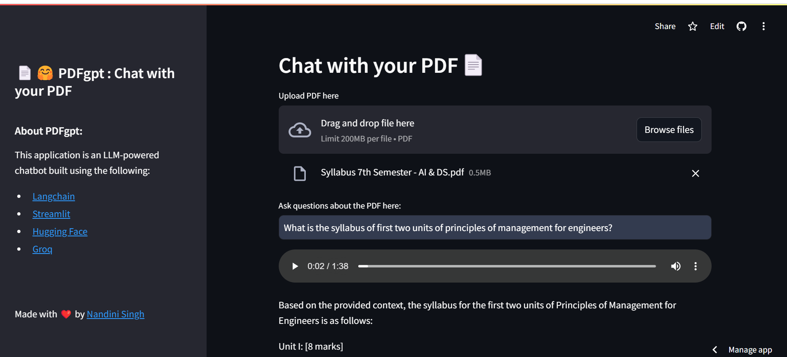

<h1> 
 PDFgpt 📄🤖 
 </h1>

PDFgpt is an LLM-powered application that lets users upload PDF documents and get precise, context-based answers through both text and audio outputs. By leveraging advanced language models, it quickly analyzes document content, providing multimodal responses for a seamless and interactive experience. Whether it’s for research, manuals, or large documents, PDFgpt makes querying information fast, intuitive, and accessible.

  
🌟 Try it here: [pdfgpt-llama-huggingface.streamlit.app](https://pdfgpt-llama-huggingface.streamlit.app/)

### ✨ Key Features
- 📁 Users can upload PDFs up to **200MB** in size.
- 📝 The chatbot responds with both **text** and **audio** answers, generated using Google Text-to-Speech (gTTS).
- ⚡ Powered by advanced language models, including **LLaMA3-8b-8192**, to deliver **accurate** and **contextual** answers.

### 🛠️ Built With
- **[Langchain](https://www.langchain.com/):** 🧠 For handling text processing and language model interactions.
- **[Streamlit](https://streamlit.io/):** 🖥️ For building the user interface.
- **[Hugging Face](https://huggingface.co/):** 🤗 For accessing language models and embeddings.
- **[Groq](https://groq.com/groqcloud/):** ⚙️ For integrating high-performance language models.
- **[Chroma](https://www.trychroma.com/):** 🔍 For vector storage and similarity search.

### 🚀 How It Works
1. **Upload PDFs**: 🗂️ Users can upload PDF documents via the interface.
2. **Text Extraction**: 📜 The PDF content is extracted and split into chunks for efficient processing.
3. **Embedding & Vector Store**: 🧬 The text chunks are embedded using SentenceTransformer models, and the embeddings are stored in Chroma for fast similarity search.
4. **Query Processing**: 🧐 Users can ask questions related to the PDF content, and the application retrieves relevant text chunks based on similarity search.
5. **LLM-Powered Response**: 🤖 The Groq-powered language model analyzes the relevant text and provides a comprehensive response.
6. **Text-to-Speech**: 🔊 The answer is converted into audio using gTTS, allowing users to listen to the response.

💬 Recommendations or improvements are welcome!
